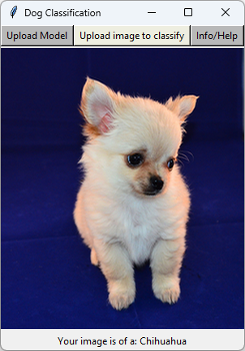
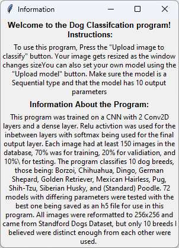

# Dog Image Classifer

[Chihuahua Image Source](https://www.pickpik.com/long-haired-chihuahua-puppy-sweet-little-dog-tiny-70765)

This is a python project for classifying 10 different dog breeds.
This project has been trained on the [Stanford Dogs dataset](http://vision.stanford.edu/aditya86/ImageNetDogs/). 
The whole dataset is not used, just 10 breeds I believed to be distinct enough from each other:
- Borzoi
- Chihuahua
- Dingo
- German Shepherd
- Golden Retriever
- Mexican Hairless
- Pug
- Shih-Tzu
- Siberian Husky
- Standard Poodle
## Motivation
This project was done as a part of my Artifical Intelligence class. I chose to classify dogs specifically since dogs are my favorite pets. I have two dogs off my own that are a beagle/chihuahua mix and have owned many more dogs from when I was younger. In addition, being able to make an image classifier is something I wish to refine as there is a personal project I have in mind regarding classifying pokemon cards.
## Features
- Classifies 10 different dog breeds from an image (PNG or JPG)
- Allows the user to switch to their own model (model needs to have 10 output layers and be a Sequential model or an error will be raised)
- Info Button with information about program and some help
- Image and button resizing when resizing window

## Installation
- Make sure to have [Python](https://www.python.org/downloads/release/python-3123/) installed (I used Python version 3.12.3)
- Download this project either by 
    - Downloading the source code as a zip and unzipping to your desired location
    - using `git clone https://github.com/RannerJP/Dog-Image-Classifier.git`. Make sure you have [git](https://git-scm.com/downloads) installed
- (Optional) I highly recommend having a [virtual enivorment](https://www.freecodecamp.org/news/how-to-setup-virtual-environments-in-python/) if you have other python projects as well
- Install the required dependencies by running `pip install -r requirements.txt` in the project directory
- Run `Main.py`

**NOTE**: If the filesize is too big, navigate to the `models` folder and remove all models except `DogClassification.h5` (These models are only used for testing the program)

I eventually plan on adding a `run.bat` and a `run.sh` for convenience.
## Usage

- The program starts with a default model already loaded (DogClassification.h5)
    - If you wish to use your own model, you can load it with the "Upload Model" button (Make sure it has 10 output layers and is of type Sequential)
- When you are ready to classify an image:
    - Press the "Upload Image to Classify" Button
    - Choose your desired image to classify
    - Wait and see your classification on the screen
- Use the "Info/Help" to see instructions and information about the program

Info Screen from application

## License

[GNU GPLv3](https://choosealicense.com/licenses/gpl-3.0/)
